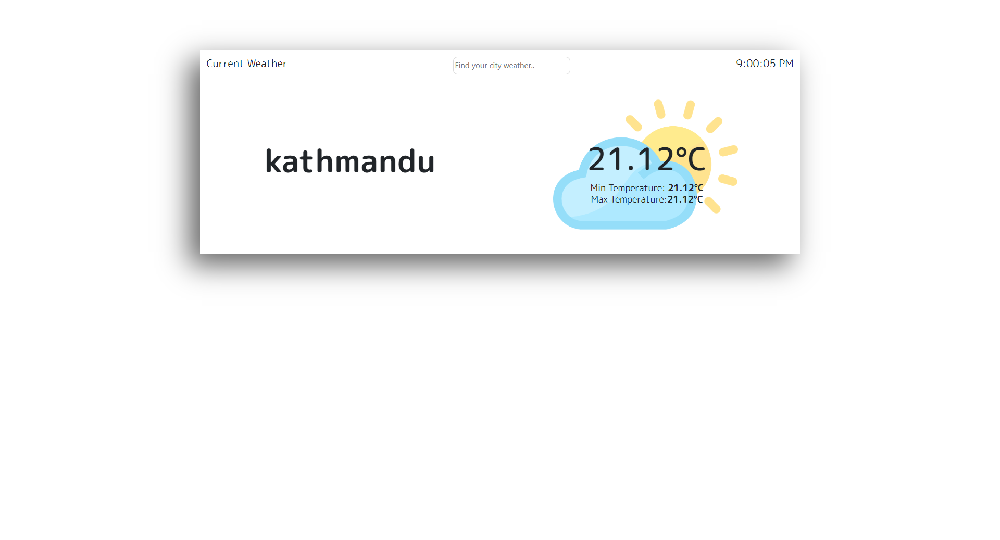
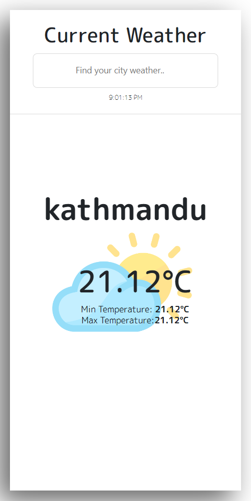

# Wheather

I created this weather app by utilizing React Hooks and integrating it with an API.

## Features

Through this web application, you can view the live weather updates of your city by searching for it.

## Installation

Instructions on how to install and set up the project.

### Installation

#### Commands

```bash
npm install
```

or

```bash
npm i react
npm i bootstrap
npm i font-awesome
```

#### Env

### screenshots

### Desktop View



### Mobile View


